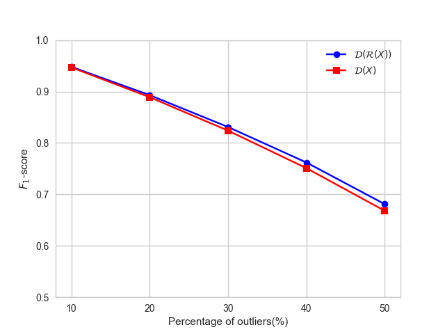
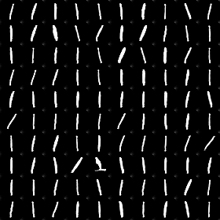
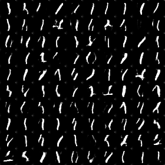

# Adversarially Learned One-Class Classifier for Novelty Detection
This repository contains the non-official code for the paper [Adversarially Learned One-Class Classifier for Novelty Detection](https://arxiv.org/abs/1802.09088).

## Requirements
- Python 3.6
- Chainer 4.1.0
- CuPy 4.1.0

## Training
To train the network on MNIST dataset (target digit = '0'):

    $ python train.py --gpu 0 --out result_0 --digit 0

To test the network on MNIST dataset (target digit = '0'-'9', percentage of outliers = 0.5):

    $ python test.py --gpu 0 --percent 0.5

## Results

$\mathcal{D}(\mathcal{R}(X))$ の方が $\mathcal{D}(X)$ よりも性能が良いことが確認できる．

'1'をターゲットクラスとして学習した場合に，ネットワーク $\mathcal{R}$ によってリコンストラクションされた，ターゲットクラス（'1'）の画像．

'1'をターゲットクラスとして学習した場合に，ネットワーク $\mathcal{R}$ によってリコンストラクションされた，外れ値（'1'を除く'0'-'9'）の画像．

## 備考
この実装では，論文中の$F_1$-scoreを再現できていない．考えられる原因としては，以下のハイパーパラメータが不明であることがあげられる．
* ネットワークの構造について，詳細が不明である(padding, stride, Batch Normalizationなど)．
* Optimizerが不明であり(本コードではAdamで実装している)，学習率など各種ハイパーパラメータが不明である．
* 入力画像に加えるノイズ $\eta$ の標準偏差 $\sigma$ が不明である．
* 分類器の外れ値を決める閾値 $\tau$ が不明である．
* 学習を終了するタイミング $\rho$ が不明である．
